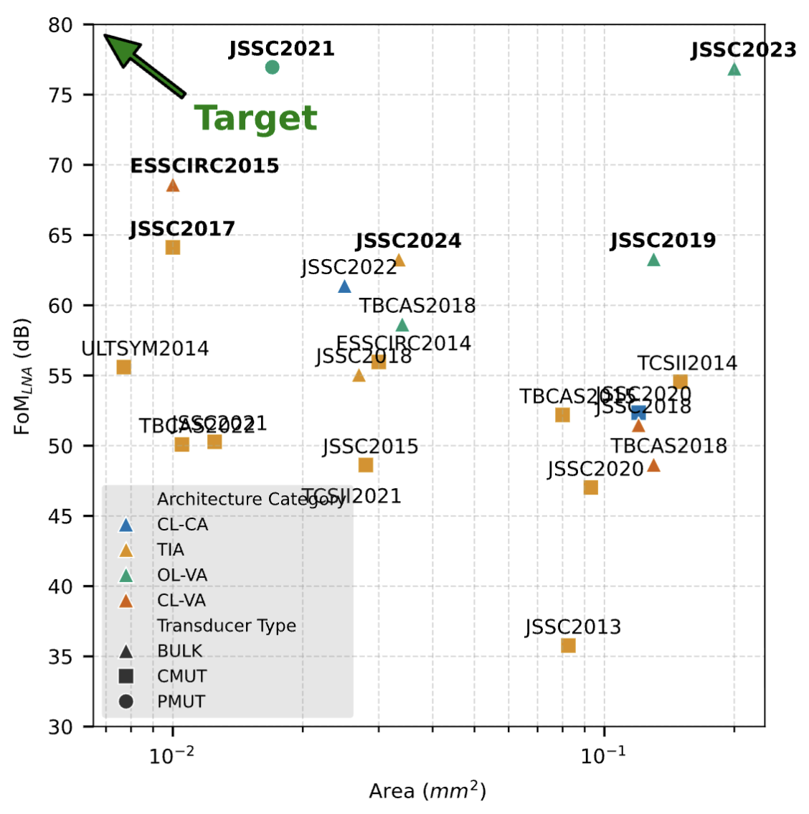
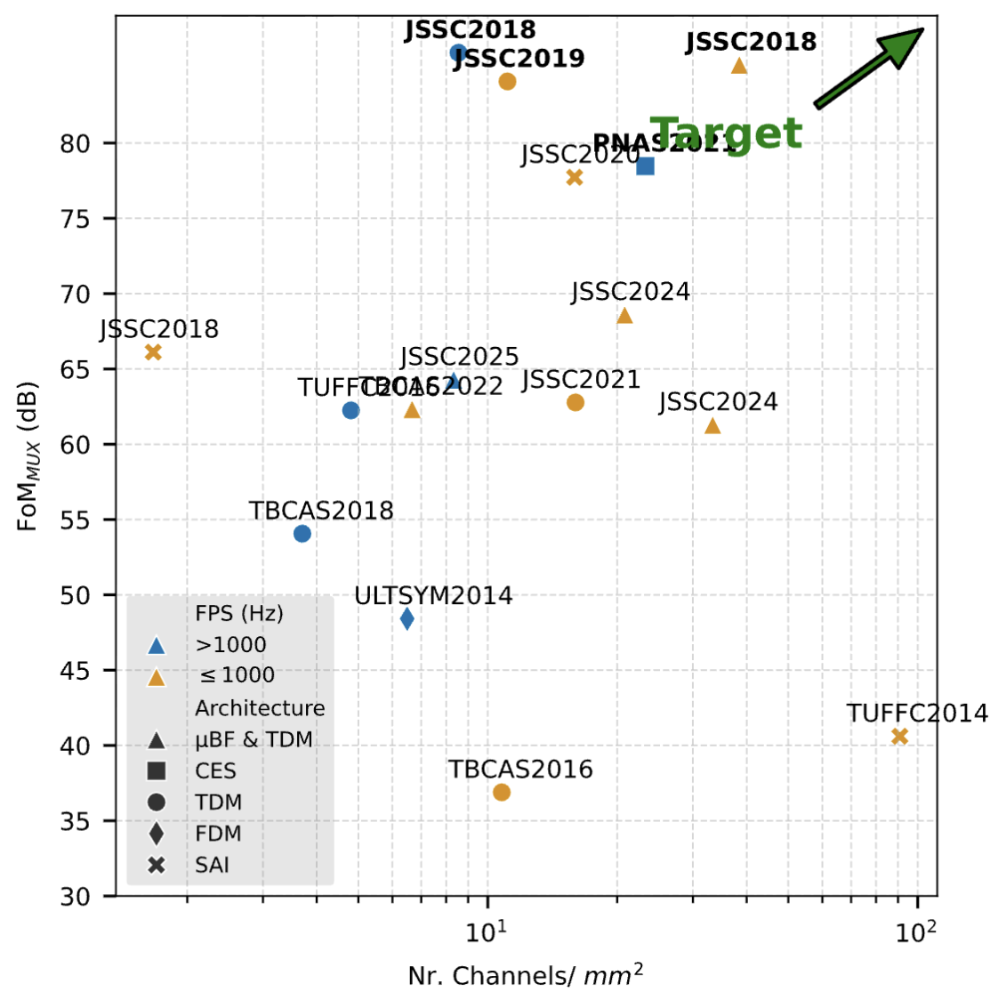

# Ultrasound-on-Chip Analog Front End Survey

This repository contains a survey on existing works on 

1. Low Noise Amplifiers for UoC designs

2. Channel Multiplexing and Data Reduction architectures in UoC designs

The aggregated data aims to provide insights on how to address the main challenges regarding the miniaturization of UoC devices:

1. How to fit more channels in the same area (How to reduce active area per channel)

2. How to reduce the power dissipation per channel

3. How to compress the total output data throughput of ultrasound imaging (diagnostic) integrated devices - Essentially, how to transmit the same amount of (diagnostically-relevant) information with less energy?

## Ultrasound Low Noise Amplifier Architectures and Figures of Merit

Here, a modified Schreider FoM is used to provide a comparison between [existing LNA UoC architectures](./data/us_lna_survey_post_processed.csv), and how their choice, along with the corresponding ultrasound transducer architecture, promote UoC miniaturization without loss of core functionality (low noise contamination in readout).

$$
FoM_{LNA} = SNR + 10 \ log_{10} \left( \frac{B}{P_D} \right) \ (dB)
$$

where $P_D$ is the power dissipation per channel, and  $B$ is the -3dB bandwidth of the LNA.

The FoM is plotted against the area p/ channel each LNA occupies.



## Ultrasound Data Compression & Multiplexing Architectures and Figures of Merit

Once again, a modified Schreider FoM is used to provide a comparison between [existing multiplexing and data compression UoC architectures](./data/us_mux_afe_survey_post_processed.csv), evaluating how they promote UoC miniaturization by enabling agressive time and aperture-domain ultrasound data compression without compromising diagnostic outcome.

$$
FoM_{MUX} = DR_{in}+ 10 \ log_{10}\left( \frac{C}{F_{S} \cdot P_D}\right)
$$

where $C=\frac{\mathrm{Input \ Channels}}{\mathrm{Output \ Channels}}$ is the Aperture-Domain Compressure Ratio, and decreasing global sampling rate $F_S$ is used as a Time-Domain Compression metric (meaning the reduction of the number of requried time samples to produce a diagnostic outcome - an US image), and $P_D$ is the power dissipation per channel.

The FoM is plotted against number of channels per millimiter of the compression method used. 




## Contributing:

Just open up a Github Issue so we can discuss it together.

## Citing

If you want to refer back to this compendium, you can use:

```
@misc{us_afe_survey,
   author = {Dias, Diogo},
   title = {{Ultrasound-on-Chip Analog Frontend Performance Survey 2014-2026}},
   note = {[Online]. Available: \url{https://github.com/das-dias/sota-us-afe}}
}
```

